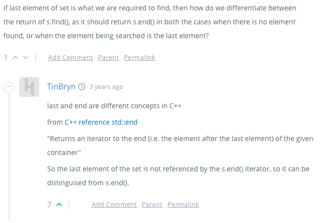

# yo, you were wrong about the end() function.

End does not return the pointer to the last element, but actually it refers to the element after the last element. See this discussion.



That's why it works properly

```cpp

for (vector<int>::iterator itr = v.begin(); v != v.end(); v++)
{
    /* code */
}

```

Because in the above loop it does not reach the v.end(). It only goes upto the element just before that.

This concept is similar in sets, where `s.find(x)` (s is an set) function returns the `s.end()` if there is no element `x` in the set `s`. Earlier I was confused that if it returns the end element it might be a problem to us because it can be the last element. But no it is not the last element so we can just directly check do this.

```cpp

if(s.find(x) == s.end()) {
    cout << "Element x was not found" << endl;
} else {
    cout << "Element x was found" << endl;
}

```


